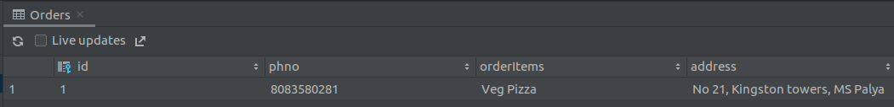
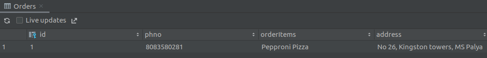

# SQLite 

- Design a form to accept entries to store in a dB
- Create DataHelper class
- Perform CRUD operations on the dB.

### CRUD operations 

#### 1. Insert data

> Order.db

#### 2. Update data

> Order.db

#### 3. Delete record and view data

> Order.db

