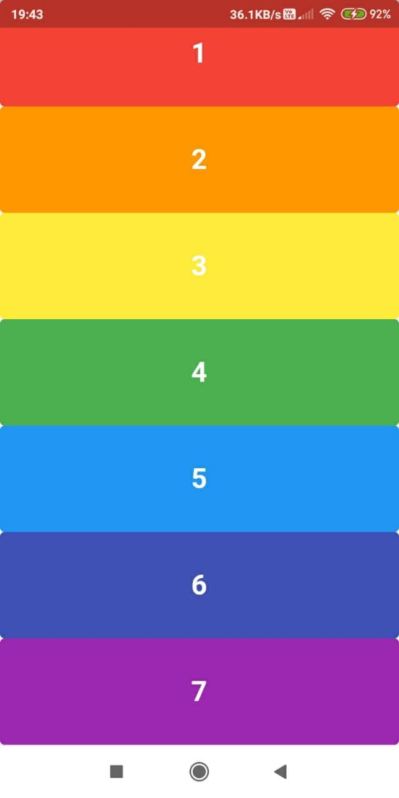

# Xylophone App

Build a flutter app that imitates the behaviour of a physical Xylophone.

- Uses a thrid-party library [audioplayers](https://pub.dev/packages/audioplayers). So, remember to add this dependency to
your `pubspec.yaml`.
 
## Output

  

